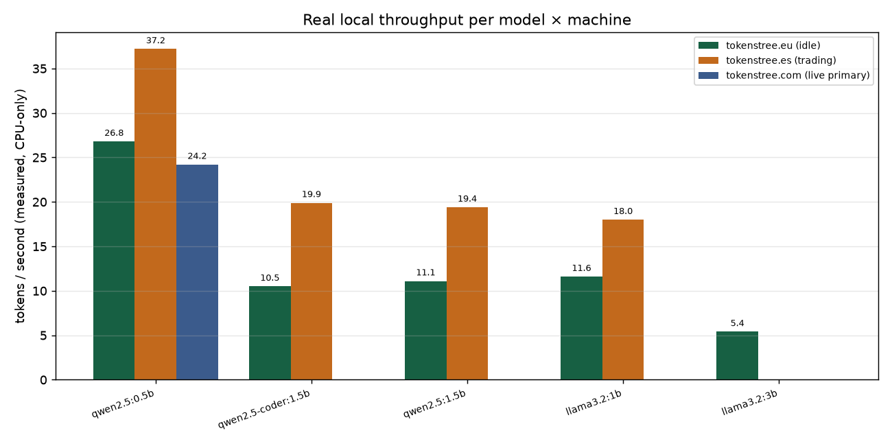
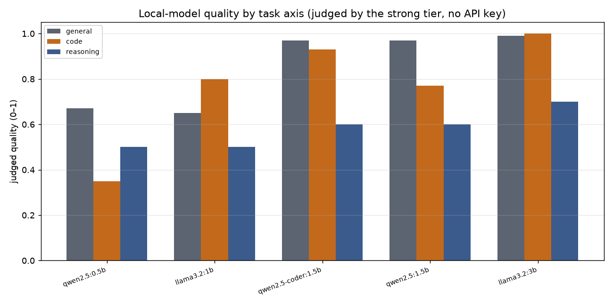
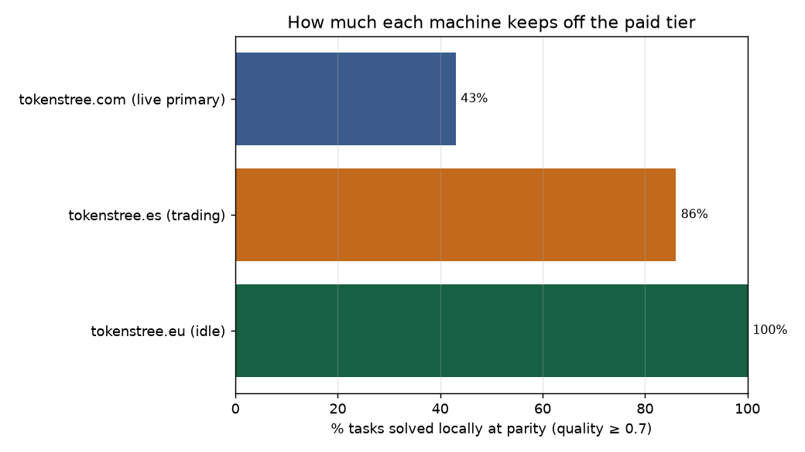

# hibrid benchmark study — local routing on three real CPU servers

**Question.** When hibrid sits under an AI tool, how much real work can it keep on a *local*
model — and how does that depend on the machine — so that the strong tier (reached through your
agent subscription, **no API key**) is spent only when it earns it?

**TL;DR.** On three production CPU-only VPS (no GPU), local small models handled **43–100 %** of a
seven-task suite at parity, at **5–37 tokens/second**. The fraction that stays off the paid tier
is set by the machine's model fleet — which is exactly what hibrid routes on. And two machines
with *identical* spec sheets measured **~2× different** throughput, which is why hibrid times each
machine instead of trusting the spec.

---

## 1. Method

### Machines (real, in production)

| Machine | Role | CPU | RAM | GPU | Local models tested |
|---|---|---|---|---|---|
| `tokenstree.eu` | mostly idle | 4× AMD EPYC-Milan | 8 GB | none | qwen2.5 0.5b/1.5b, qwen2.5-coder 1.5b, llama3.2 1b/3b |
| `tokenstree.es` | live trading app | 4× AMD EPYC-Milan | 8 GB | none | qwen2.5 0.5b/1.5b, qwen2.5-coder 1.5b, llama3.2 1b |
| `tokenstree.com` | live social primary (1.1 GB free) | 4× AMD EPYC-Milan | 8 GB | none | qwen2.5 0.5b only |

Models were sized to each machine's free memory — the memory-starved live primary only had room
for a 0.5 B model. That constraint is itself a result: it is the routing input.

### Task suite (`bench.py`)

Seven real use-cases, each tagged with the hibrid task type/axis it exercises: `translate`,
`classify`, `extract` (general); `summarize` (general); `code_fix` (loop_refine/code),
`code_write` (code); `reason` (deep_reason). All at temperature 0, `max_tokens=256`, after a
warm-up call per model to exclude weight-load time. Local inference via the ollama
OpenAI-compatible endpoint. The script makes **zero paid calls**.

### Metrics

- **Throughput** — measured tokens/second per (model, machine).
- **Quality (0–1)** — each output judged against a reference by the orchestration/strong tier
  (no API key). `quality.json` records every score and the reference answers.
- **Local-at-parity** — a machine "solves a task locally" if its *best available* local model
  scores ≥ 0.7. This drives the headline "% kept off the paid tier".

Raw data: [`raw/`](raw). Judgments: [`quality.json`](quality.json). Reproduce charts:
`python3 analyze.py`.

---

## 2. Results

### Throughput — measured, not guessed

5–37 tok/s on CPU. The smallest model (qwen2.5:0.5b) clears 24–37 tok/s on all three — usable
even on the 1.1 GB live primary. The 3 B model runs at ~5 tok/s — fine for batch, slow for chat,
which is why hibrid's utility function down-weights slow local models for interactive tasks.

**The headline surprise:** `tokenstree.es` and `tokenstree.com` — and even the "idle"
`tokenstree.eu` — have the *same spec sheet*, yet measured throughput differs by up to ~2× (e.g.
qwen2.5:0.5b: 37 tok/s on `.es` vs 27 on `.eu`). Neighbour load, live workload and scheduling
make real tok/s unpredictable from RAM/VRAM numbers. **No router that reads the spec sheet can
know this; hibrid measures it at startup.**

### Quality by task axis

A clean capability ladder, and it is **axis-dependent** — which is the whole point of routing by
task type:

- **qwen2.5:0.5b** is fine for translate/classify (1.0) but **hallucinated emails** on `extract`
  (0.0) and returned no code on `code_write` (0.3). Tiny models are safe only for the easiest axis.
- **qwen2.5-coder:1.5b** — the specialist — tops code (0.93) *and* general (0.97) at 1.5 B.
- **llama3.2:3b** leads overall (general 0.99, code 1.0), at the cost of ~5 tok/s.

This is why hibrid picks the best local model **for the detected axis**, not the biggest that
fits: for a coding task on `.es` it routes to qwen2.5-coder:1.5b, not llama3.2:1b.

### How much each machine keeps off the paid tier

| Machine | Best local fleet | Tasks solved locally (≥0.7) |
|---|---|---|
| `tokenstree.eu` | up to llama3.2:3b | **100 %** |
| `tokenstree.es` | up to 1.5 B | **86 %** |
| `tokenstree.com` | 0.5 B only | **43 %** |

The capable box sends *nothing* to the paid tier for this suite; the memory-starved live primary
must escalate the majority. Same router, opposite behaviour — driven entirely by what each machine
can actually run. That is hibrid's thesis in one chart: **the machine decides how much is free.**

---

## 3. What this means for routing

1. **Measure, don't guess.** ~2× throughput spread across identical specs ⇒ the startup
   micro-benchmark is not a nicety, it's required for correct latency-aware routing.
2. **Route by axis, not size.** A 1.5 B coder beats a 1 B generalist on code and a 0.5 B model on
   everything; the per-axis catalog (`models_catalog.py`) is what turns "fits in RAM" into "good
   enough for *this* task".
3. **Local coverage is a property of the machine.** 43 % → 100 % purely from the model fleet. The
   paid tier (via your agent subscription, no key) is the top of the ladder, used in proportion to
   what local can't reach.

## 4. Threats to validity

- **Small suite (7 tasks), single judge.** Indicative, not a leaderboard. RouterBench/RouterEval
  integration is on the [roadmap](../ROADMAP.md) for a defensible KPI.
- **`max_tokens=256` truncated some `reason` answers** before the final number, depressing the
  reasoning axis uniformly. Re-run with a higher cap will raise those scores.
- **Quality is judged, not gold-labelled**, except where objective (classify/extract/code).
- **CPU-only, ≤3 B.** A GPU or Apple-silicon box would shift every bar right and raise local
  coverage; these numbers are the *floor*, not the ceiling.

Data and code in this folder are self-contained — `python3 bench.py` on any machine reproduces a
row, `python3 analyze.py` rebuilds every chart.

---

## Companion study — token savings across an agent session

This study measures *throughput* and *local-at-parity coverage*. A companion measurement,
[`token_savings.md`](token_savings.md), runs a realistic 16-call agent session (a refactor loop plus
a few hard one-shots) end to end through a local engine with the strong tier wired in, and counts the
**frontier tokens avoided**: 9/16 calls stayed local, the full refactor loop never reached a paid
model, and 42% of frontier tokens were avoided on the `cpu_8gb` box. Reproduce with
`python3 token_savings_run.py`.
