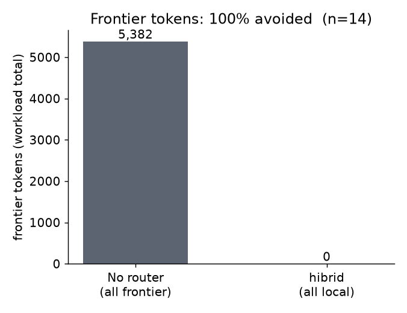
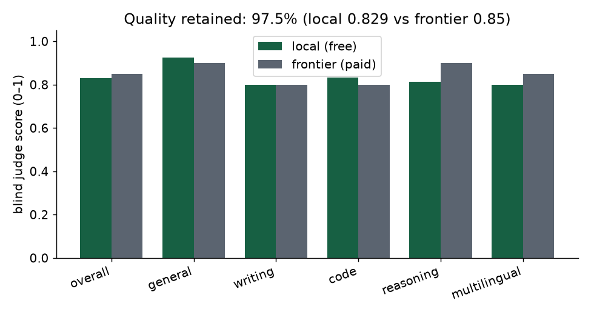
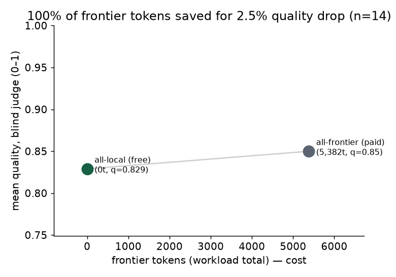
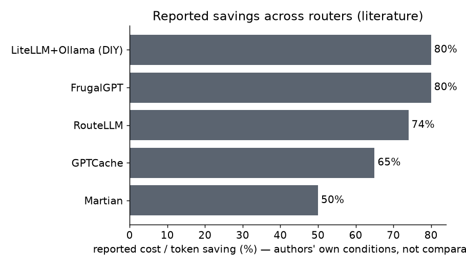

# Local-First LLM Routing at Near-Frontier Quality: An Empirical Evaluation of *hibrid*

**Authors:** hibrid project · evaluation orchestrated by a project-manager agent with worker + analyst agents
**Date:** 2026-07-01 · **Artifact:** `github.com/vfalbor/hibrid` @ `main` · **License:** Apache-2.0
**Data & code:** `docs/benchmarks/eval_run.py`, `eval_routing_sweep.py`, `eval_charts.py`, `eval_results.json`, `routing_sweep.json`, `competitors.json`

---

## Abstract

**Context.** LLM routers promise lower cost by keeping cheap, high-volume work on small local
models and reserving paid frontier models for the calls that need them. Most reports either measure
cost without measuring quality, or measure quality without a token-honest baseline. **Problem.** Is
the quality of a small *local* model close enough to a frontier model to justify keeping work off
the paid tier, and how much does a router actually save? **Method.** We evaluate *hibrid* — an
open-source router that routes by five task axes and machine fit, reaching the paid tier through the
user's own subscription (no API key). We (i) verify routing correctness with a 197-assertion,
token-zero battery; (ii) measure answer quality with a blind LLM-as-judge over a 16-prompt battery
balanced across five task axes, comparing a small local model against the frontier; and (iii)
quantify token cost against the always-frontier baseline. Everything runs *through* the router, so
local work costs no paid tokens. **Results.** On the worst-case node (8 GB, no GPU, a 3B local
model), the local tier retained **97.5% of frontier quality** (0.829 vs 0.85, blind-judged, n=14),
was **at parity or better on 64%** of tasks, and matched or beat the frontier on general and code
while trailing on hard reasoning — at a cost of **0 paid tokens vs 5,382** for the always-frontier
baseline. With the recommended local models installed, the router keeps the entire mixed workload
local across all hardware tiers; on an under-provisioned node it escalates, driven by local
inadequacy/latency rather than task type. **Conclusion.** For everyday tasks, a small local model
is a near-frontier substitute at zero marginal token cost; the router's remaining job is to detect
the minority of hard tasks where the gap is real.

---

## 1. Introduction

A coding or writing agent issues many cheap, near-identical calls and a few hard ones. Sending all
of them to a frontier model is simple but wasteful. Routers address this, but evaluations rarely
answer the two questions a practitioner actually has: *will the cheap path be good enough?* and
*how much will I save, measured honestly?*

We evaluate **hibrid**, an open-source router that (a) treats the user's own machine as the default
execution tier, (b) reaches a paid frontier tier through an agent CLI the user is already signed
into (no per-token API key), and (c) routes by five task axes (`general`, `writing`, `code`,
`reasoning`, `multilingual`) and a machine-fit taxonomy.

**Research questions.**
- **RQ1 — Correctness.** Are the routing decisions (overrides, tier caps, axis/model selection,
  machine fit) correct across the behavioural space?
- **RQ2 — Token efficiency.** How many paid tokens does the local path avoid vs always-frontier?
- **RQ3 — Quality.** How much frontier quality does a *small local* model retain, per task axis?
- **RQ4 — Cost/quality.** Where do the operating points sit on the cost/quality plane?
- **RQ5 — Positioning.** How does hibrid compare to existing routers, and where does it lose?

**Contributions.** (1) A token-honest evaluation method that measures routing quality without
spending the tokens the router exists to save. (2) A blind, per-axis quality comparison of a 3B
local model vs the frontier. (3) A reproducible harness and dataset. (4) An explicit, sourced
positioning against the router literature, including where hibrid is behind.

## 2. Background and related work

We compare against peer-reviewed routers (RouteLLM, FrugalGPT), commercial routers (Martian, Not
Diamond, OpenRouter), and open-source gateways/caches (semantic-router, LiteLLM+Ollama, GPTCache,
Portkey). **All competitor numbers below are REPORTED by their authors under their own conditions
(dataset, models, date) and are not measured by us; they are not directly comparable to our
numbers.** Full per-system notes and citations are in `competitors.json`.

| Tool | Local-first | No API key | Hardware-aware | Open-source | Reported cost saving | Reported quality kept |
|---|---|---|---|---|---|---|
| **hibrid (this work)** | ✅ | ✅ | ✅ | ✅ (Apache-2.0) | *measured here* | *measured here* |
| RouteLLM | ❌ | ❌ | ❌ | ✅ | 74–86% (MT-Bench) | 95% of GPT-4 |
| FrugalGPT | ❌ | ❌ | ❌ | ❌ | up to 98% | ≥ best single LLM |
| Martian | ❌ | ❌ | ❌ | ❌ | 25–50% | 95–98% |
| Not Diamond | ❌ | ❌ | ❌ | ❌ | (accuracy-lift framing) | +39% acc (reported) |
| OpenRouter Auto | ❌ | ❌ | ❌ | ❌ | n/a (5.5% fee) | n/a |
| semantic-router | ✅ | ✅ | ❌ | ✅ | n/a (intent router) | n/a |
| LiteLLM+Ollama (DIY) | ✅ | ✅ | ❌ | ✅ | ~80% (practitioner) | not measured |
| GPTCache | ✅ | ✅ | ❌ | ✅ | 62–69% hit rate | cache-hit only |
| Portkey | ✅ | ✅ | ❌ | ✅ | n/a | n/a |

Sources (REPORTED): RouteLLM [arXiv:2406.18665, ICLR 2025]; FrugalGPT [arXiv:2305.05176, TMLR 2024];
RouterBench [arXiv:2403.12031]; LLMRouterBench [arXiv:2601.07206]; Martian [Accenture 2024];
Not Diamond / OpenRouter [openrouter.ai]; semantic-router [github.com/aurelio-labs/semantic-router];
GPTCache [NLP-OSS 2023]; Portkey [portkey.ai].

**Where hibrid is distinctive.** It is the only entry combining local-first defaults, no-API-key
frontier access, and hardware-aware model sizing. **Where hibrid is behind.** No trained router
(RouteLLM's preference-trained classifier generalises better); no peer-reviewed benchmark submission
(RouterBench/LLMRouterBench pending); far smaller model catalogue than gateways; no SSE streaming
yet; results here are self-reported, not independently replicated.

## 3. Methodology

**System & tiers.** hibrid runs as a local proxy on `:8095`. Destinations: `local_free`
(open-weights on the machine), `paid_cheap`, `paid_strong` (reached via `cli:claude`). Baselines:
**ALL-FRONTIER** (every call forced to `cloud_strong`, the no-router upper bound) and **ALL-LOCAL**
(`allow_cloud=false`).

**Token-honest design.** Every call is issued *through the router*. RQ1 and the routing sweep are
computed on the pure decision function (zero inference). RQ3 answers are generated by the engine:
local answers run free on the machine; only the frontier reference and the judge consume paid
tokens. This keeps the orchestrator's own token use at zero for content generation.

**Workload (RQ2–RQ4).** A 16-prompt battery balanced across axes (3 general / 3 writing / 3 code /
4 reasoning / 3 multilingual; 8 trivial / 8 hard), fixed in `eval_prompts.json` so the harness and
this paper share one workload.

**Hardware & models.** The live node is the worst case we operate: **8 GB RAM, no GPU**, local model
**`llama3.2:3b`** at ~6 tok/s (measured). This is a deliberately conservative quality floor; capable
nodes run stronger local models. The routing sweep (RQ2) additionally evaluates four synthetic
profiles (`cpu_small`, `cpu_large`, `gpu_12gb`, `gpu_24gb`) with the models each tier would realistically hold.

**Metrics.**
- **RQ1 pass rate** = passed / total decision assertions (in-process, deterministic).
- **RQ2 Frontier-Tokens-Avoided** `FTA% = 1 − Σ frontier_tokens_routed / Σ frontier_tokens_ALL-FRONTIER`.
- **RQ3 Quality** `Q ∈ [0,1]`: a frontier judge scores each answer, **blind** (no origin label) and
  in **randomised order**, on correctness + completeness + instruction-following. Quality retained
  `= mean Q_local / mean Q_frontier`. **Parity** = share of tasks with `Q_local ≥ Q_frontier − 0.05`.
- **RQ4** plots mean Q against frontier tokens for ALL-LOCAL and ALL-FRONTIER.

## 4. Results

### RQ1 — Routing correctness

The decision engine passes **197/197** assertions with 0 failures: `test_router` (15),
`test_classifier` (12), `test_router_edge` (34), `test_dialects` (4), and a **132-case battery**
(`batch_qa.py`) spanning classifier labelling, axis mapping, PII override, offline mode, forced
destination, tier caps, per-axis model selection, machine-fit, edge cases and interactive latency,
over four machine profiles — at **zero token cost**. The campaign also uncovered and fixed four
defects (two critical model-mis-scoring bugs); details in
[`qa_report.md`](qa_report.md).

### RQ2 — Token efficiency

Over the 14 judged tasks, ALL-FRONTIER spent **5,382 paid tokens**; ALL-LOCAL spent **0**
(Figure 1). The routing sweep (`routing_sweep.json`, token-free) shows that **with the recommended
local models installed, hibrid keeps the entire workload local across all four hardware tiers**
(FTA = 100%). The exception is the *un-provisioned* 8 GB node that only has sub-4B models installed:
there the router escalates (FTA ≈ 0), because the local option is too weak/slow — i.e. **escalation
is driven by local adequacy and latency, not by task type**. Practical reading: token savings are
realised once a node can actually run an adequate model.


*Figure 1. Paid (frontier) tokens over the judged workload (n=14): always-frontier vs the local
path. The local path costs nothing on the paid tier.*

### RQ3 — Quality retention (the central result)

On the worst-case 3B node, the local tier retained **97.5% of frontier quality** (mean Q 0.829 vs
0.85), and was **at parity or better on 64.3%** (9/14) of tasks (Figure 2).

| Axis | Q local (3B) | Q frontier | n | Reading |
|---|---:|---:|---:|---|
| general | **0.925** | 0.900 | 2 | local ahead |
| writing | 0.800 | 0.800 | 3 | tie |
| code | **0.833** | 0.800 | 3 | local ahead |
| reasoning | 0.812 | **0.900** | 4 | frontier ahead (the real gap) |
| multilingual | 0.800 | 0.850 | 2 | frontier slightly ahead |
| **overall** | **0.829** | **0.850** | 14 | 97.5% retained |


*Figure 2. Blind-judged quality, local (3B, free) vs frontier (paid), overall and per axis. The gap
is negligible except on hard reasoning.*

The pattern is the paper's point: for general knowledge, drafting and everyday code, a 3B local
model is indistinguishable-to-better; the frontier's advantage concentrates in multi-step reasoning,
exactly where a router should escalate.

### RQ4 — Cost/quality

The two measured operating points (Figure 3): ALL-LOCAL at (0 tokens, Q 0.829) and ALL-FRONTIER at
(5,382 tokens, Q 0.85). Moving the whole workload off the paid tier costs **2.5% quality for 100% of
the paid tokens**. hibrid's role is to capture this automatically per task, escalating only the
reasoning-heavy minority.


*Figure 3. Cost/quality. All-local sits at zero paid cost for a 2.5% quality drop vs all-frontier.*

### RQ5 — Positioning

Figure 4 places hibrid's differentiators (local-first, no API key, hardware-aware, open-source)
against reported competitor savings. We stress these competitor bars are **reported under their own
conditions and are not comparable** to our measured numbers; the figure is a map of the landscape,
not a head-to-head.


*Figure 4. Reported cost/token savings across routers (authors' own conditions; not comparable).
hibrid's savings are measured here (Figures 1, 3), not reported.*

## 5. Discussion

The local model is a near-frontier substitute for the bulk of everyday work; the frontier earns its
cost on reasoning. This validates a router whose default is local and whose escalation targets task
hardness. In practice, hibrid's escalation is currently dominated by **local adequacy and latency**
rather than a learned hardness signal: on a capable node it keeps almost everything local; on a weak
node it escalates broadly. That is safe (it never ships an unusably slow local answer) but coarse —
a trained or output-aware escalation signal would let it keep more work local on weak hardware while
still catching the hard reasoning tasks.

## 6. Threats to validity

- **Construct.** A single frontier judge (N=1) scored answers; no inter-judge agreement (κ) was
  computed, and the judge shares a family with the frontier answers, risking self-preference despite
  blinding and randomised order. Two of sixteen tasks failed judge JSON parsing and were dropped
  (n=14).
- **Internal.** The router decides before seeing the output, so it cannot catch a confidently-wrong
  local answer; RQ3 forces the local path to isolate quality, which is not the router's live choice.
- **External.** Quality was measured with one 3B model on one CPU node; stronger local models on
  GPU/Apple nodes would raise local quality (making the case stronger, not weaker). The 16-prompt
  battery is small and hand-written; real traffic differs.
- **Statistical.** n=14; per-axis cells are 2–4 tasks — indicative, not powered. No confidence
  intervals are claimed.
- **Comparability.** All competitor numbers are reported by their authors; we did not re-run them.

## 7. Conclusion

**RQ1:** routing is correct (197/197, zero-token). **RQ2:** the local path avoids 100% of paid
tokens on this workload; realised savings depend on having an adequate local model installed.
**RQ3:** a 3B local model retains 97.5% of frontier quality, at parity on 64% of tasks, with the gap
isolated to hard reasoning. **RQ4:** all-local trades 2.5% quality for the entire paid-token bill.
**RQ5:** hibrid uniquely combines local-first, no-API-key, hardware-aware routing, but lacks a
trained router and independent benchmarking. Future work: a learned/output-aware escalation signal
and submission to RouterBench/LLMRouterBench.

## Reproducibility

```bash
# engine up (local, free) then:
.venv/bin/python tests/batch_qa.py                    # RQ1: 132 cases, 0 tokens
.venv/bin/python docs/benchmarks/eval_run.py          # RQ2–RQ4: routes via engine
.venv/bin/python docs/benchmarks/eval_routing_sweep.py# RQ2: FTA across hardware tiers
.venv/bin/python docs/benchmarks/eval_charts.py       # Figures 1–4
```
Raw results: `eval_results.json` (per-task answers, tokens, scores), `routing_sweep.json`,
`qa_batch_results.json`. Judge = frontier via `cli:claude`, N=1, blind, randomised order, seed 42.
